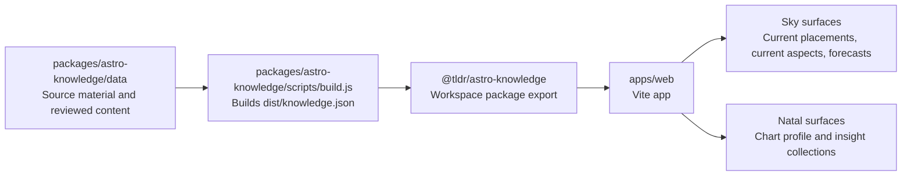

# TLDR Astro Monorepo

This repository owns the production app and the canonical astrology knowledge package.



## Workspace Layout

- `apps/web`: the TLDR Astro web app.
- `packages/astro-knowledge`: the source of truth for astrology content, schema, voice files, generators, and timing helpers.
- `services/tldrastro-api`: FastAPI calculation service for charts, timing, relationship facts, and content-ready astrology facts.

The web app imports `@tldr/astro-knowledge`. Do not vendor a copied knowledge JSON file into the app. When the knowledge package changes, run the root build so `packages/astro-knowledge/dist/knowledge.json` is regenerated before the web app builds.

## Common Commands

```bash
npm run dev
npm run dev:web
npm run build
npm run typecheck
npm run build:knowledge
```

Use `npm run dev:vercel` for local app work that touches admin or backend routes. It starts Vercel dev on `http://localhost:3000`, so `/api/*` functions are available while Vercel runs the frontend dev command behind it. Use `npm run dev` or `npm run dev:web` only for pure frontend work; those start Vite by itself on `http://127.0.0.1:5173`, and admin API routes will fail unless an API server is also running on `127.0.0.1:3000`.

Vercel builds from the monorepo root with `npm run build` and serves `apps/web/dist`.

## Platform Access Notes

These notes are intentionally limited to accounts, projects, and public deployment details. Do not store private keys, API keys, service account JSON, Supabase service role keys, OpenAI keys, or Swiss Ephemeris license files in this repo.

### Google Cloud

- Account / organization: `goldeneclipse.com`
- Cloud admin account used during setup: `hello@goldeneclipse.com`
- Google Cloud organization: `goldeneclipse.com`
- Organization ID: `64115316714`
- Directory customer ID: `C02k29xpb`
- Production API project: `tldrastro-prod`
- Production API service: `tldrastro-api`
- Region: `us-central1`
- Public Cloud Run API URL: `https://tldrastro-api-27165565299.us-central1.run.app`
- Swiss Ephemeris bucket: `gs://tldrastro-prod-swisseph`
- Artifact Registry repository: `tldrastro`

The API originally deployed successfully in project `tldrastro`, but organization policy blocked public Cloud Run access. The active production API is now in `tldrastro-prod`. Public Cloud Run access required a project-level organization policy override for `iam.allowedPolicyMemberDomains` on project number `27165565299`, setting `allowAll: true`.

Useful checks:

```bash
gcloud config set project tldrastro-prod
curl -fsSL https://tldrastro-api-27165565299.us-central1.run.app/health
curl -fsSL https://tldrastro-api-27165565299.us-central1.run.app/ready
```

### Vercel

- Production web app domain: `https://tldrastro.vercel.app`
- Vercel builds from the monorepo root.
- Build command: `npm run build`
- Output directory: `apps/web/dist`
- Production environment variable required for the browser app:

```bash
VITE_TLDRASTRO_API_URL=https://tldrastro-api-27165565299.us-central1.run.app
```

This variable is safe to be non-sensitive because `VITE_` variables are bundled into browser JavaScript. After changing it, redeploy the Production deployment without relying on stale build cache.
