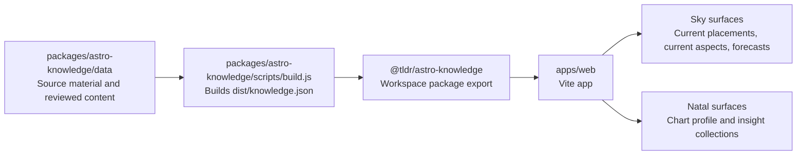
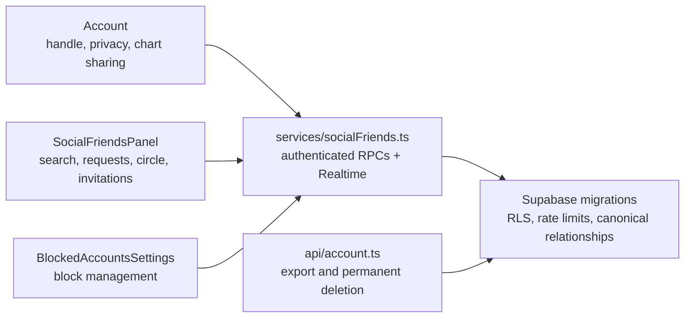

# TLDR Astro Monorepo

This repository owns the production app and the canonical astrology knowledge package.



## Workspace Layout

- `apps/web`: the TLDR Astro web app.
- `packages/astro-knowledge`: the source of truth for astrology content, schema, voice files, generators, and timing helpers.
- `services/tldrastro-api`: FastAPI calculation service for charts, timing, relationship facts, and content-ready astrology facts.

The web app imports `@tldr/astro-knowledge`. Do not vendor a copied knowledge JSON file into the app. When the knowledge package changes, run the root build so `packages/astro-knowledge/dist/knowledge.json` is regenerated before the web app builds.

## Content Precedence

Fallback copy is a floor, not a competing source. Reader-facing app surfaces should resolve copy in this order:

1. Personalized/generated content for the exact user/event.
2. Exact live generated rows for the requested content key.
3. Authored or approved knowledge-bank copy for the same placement, aspect, transit, or relationship contact.
4. Template fallback rows such as `fallback-hook/...`, only to fill blank fields.
5. Emergency copy from local composition helpers, only when no specific copy exists.

Async content and registry loading must not downgrade visible copy. If a card already has specific authored or approved reader-facing text, a later-loading broad `fallback-hook/...` template should not replace it. UI code should prefer shared copy resolvers over ad hoc fallback chains, and any new fallback path should preserve this monotonic rule. In the web app, `liveGeneratedContentByKeys` treats `afterContentFallback` as the floor by default, so template fallback rows cannot overwrite better caller-provided copy after the registry finishes loading.

Cards should also never render blank. When no specific reader-facing copy exists, show the neutral review state instead of hiding text or inventing broad placeholder interpretation.

## Social Friends Architecture

Social friendship data is owned by Supabase. The browser is an RPC client and
must not recreate authorization rules locally.



Primary ownership:

- `apps/web/src/features/friends/SocialFriendsPanel.tsx`: Friends-page state
  and interaction UI.
- `apps/web/src/services/socialFriends.ts`: typed Social RPC calls, invitation
  URL handling, and Realtime subscription.
- `apps/web/src/App.tsx`: account privacy/sharing orchestration, request count
  in global navigation, invitation capture, and account-level settings.
- `apps/web/src/features/settings/BlockedAccountsSettings.tsx`: the dedicated
  blocked-accounts screen.
- `apps/web/supabase/migrations/20260725190000_social_handles_friendships.sql`
  through
  `20260726123000_social_invitation_management.sql`: the cumulative database
  contract. Apply every migration in timestamp order; later files replace some
  earlier RPC definitions.
- `apps/web/supabase/tests/social_friend_authorization.sql`: rollback-only
  cross-user authorization test.
- `scripts/test-social-friends-contract.mjs`: static contract covering the
  complete migration and UI wiring.

The invariants that must survive future changes are:

1. A handle is unique case-insensitively, normalized at the database boundary,
   and changeable only from Account. `@tldrastro` requires the trusted admin
   app role.
2. Private accounts are absent from discovery, even for an exact handle.
   Search is authenticated, bounded, and rate-limited.
3. A stranger may see only minimal social identity and Sun sign. Moon, Rising,
   birth inputs, and the natal chart are not discovery data.
4. A request does not grant chart access. Access begins only after acceptance
   creates one canonical mutual friendship row.
5. Each side controls sharing of its own chart. A paused chart must be returned
   as `null` to the other member, not merely hidden by React.
6. Remove, block, and account deletion must revoke access in SQL immediately.
   Making an account private affects discovery but preserves accepted friends.
   UI state is not an authorization boundary.
7. Email/phone invitations are contact-bound and single-use. Store only contact
   and token hashes. The current beta opens `mailto:` or `sms:`; there is no
   server-side delivery provider.
8. Realtime is an enhancement, not the only consistency path. Keep the
   focus-refresh fallback.

Run the Social gates from the monorepo root:

```bash
npm run qa:database-friends
node scripts/test-social-friends-contract.mjs
npm run typecheck
npm run build:web
```

For a database-backed authorization run, execute
`apps/web/supabase/tests/social_friend_authorization.sql` against a seeded test
database. It wraps all mutations in a transaction and rolls back.

Release order matters:

1. Apply all committed Supabase migrations first.
2. Confirm `social_friend_requests`, `social_friendships`, and
   `social_notifications` are in the `supabase_realtime` publication.
3. Deploy the matching frontend commit.
4. Smoke-test search, request/accept, sharing pause/resume, remove, block, and
   an invitation with two authenticated sessions.

## Common Commands

```bash
npm run dev
npm run dev:web
npm run build
npm run typecheck
npm run build:knowledge
```

Use `npm run dev:vercel` for local app work that touches admin or backend routes. It starts Vercel dev on `http://localhost:3000`, so `/api/*` functions are available while Vercel runs the frontend dev command behind it. Use `npm run dev` or `npm run dev:web` only for pure frontend work; those start Vite by itself on `http://127.0.0.1:5173`, and admin API routes will fail unless an API server is also running on `127.0.0.1:3000`.

Vercel builds from the monorepo root with `npm run build` and serves `apps/web/dist`.

## Platform Access Notes

These notes are intentionally limited to accounts, projects, and public deployment details. Do not store private keys, API keys, service account JSON, Supabase service role keys, OpenAI keys, or Swiss Ephemeris license files in this repo.

### Google Cloud

- Account / organization: `goldeneclipse.com`
- Cloud admin account used during setup: `hello@goldeneclipse.com`
- Google Cloud organization: `goldeneclipse.com`
- Organization ID: `64115316714`
- Directory customer ID: `C02k29xpb`
- Production API project: `tldrastro-prod`
- Production API service: `tldrastro-api`
- Region: `us-central1`
- Public Cloud Run API URL: `https://tldrastro-api-27165565299.us-central1.run.app`
- Swiss Ephemeris bucket: `gs://tldrastro-prod-swisseph`
- Artifact Registry repository: `tldrastro`

The API originally deployed successfully in project `tldrastro`, but organization policy blocked public Cloud Run access. The active production API is now in `tldrastro-prod`. Public Cloud Run access required a project-level organization policy override for `iam.allowedPolicyMemberDomains` on project number `27165565299`, setting `allowAll: true`.

Useful checks:

```bash
gcloud config set project tldrastro-prod
curl -fsSL https://tldrastro-api-27165565299.us-central1.run.app/health
curl -fsSL https://tldrastro-api-27165565299.us-central1.run.app/ready
```

### Vercel

- Production web app domain: `https://tldrastro.vercel.app`
- Vercel builds from the monorepo root.
- Build command: `npm run build`
- Output directory: `apps/web/dist`
- Production environment variable required for the browser app:

```bash
VITE_TLDRASTRO_API_URL=https://tldrastro-api-27165565299.us-central1.run.app
```

This variable is safe to be non-sensitive because `VITE_` variables are bundled into browser JavaScript. After changing it, redeploy the Production deployment without relying on stale build cache.
