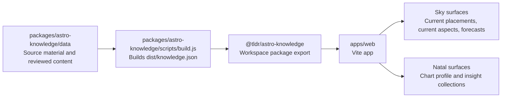

# TLDR Astro Monorepo

This repository owns the production app and the canonical astrology knowledge package.



## Workspace Layout

- `apps/web`: the TLDR Astro web app.
- `packages/astro-knowledge`: the source of truth for astrology content, schema, voice files, generators, and timing helpers.
- `services/tldrastro-api`: FastAPI calculation service for charts, timing, relationship facts, and content-ready astrology facts.

The web app imports `@tldr/astro-knowledge`. Do not vendor a copied knowledge JSON file into the app. When the knowledge package changes, run the root build so `packages/astro-knowledge/dist/knowledge.json` is regenerated before the web app builds.

## Common Commands

```bash
npm run dev
npm run build
npm run typecheck
npm run build:knowledge
```

Vercel builds from the monorepo root with `npm run build` and serves `apps/web/dist`.
