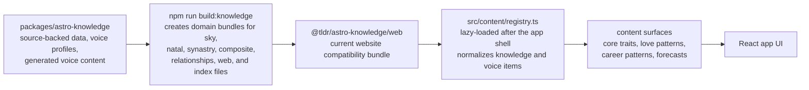

# Astrology Portal

A starter astrology website and member portal.

## Current scope

- Guest daily current-sky dashboard by location
- Supabase-backed account signup/sign-in UI for Google and email/password
- Logged-in profile page with saved starter charts
- Swiss Ephemeris current-sky calculations with deterministic fallback data
- Mock writing adapter that can be replaced with the supplied house style

## Run locally

```bash
npm install
npm run dev
```

Create a `.env.local` file using `.env.example` as a template.

```bash
VITE_MAPBOX_ACCESS_TOKEN=...
VITE_SUPABASE_URL=https://your-project.supabase.co
VITE_SUPABASE_PUBLISHABLE_KEY=sb_publishable_...
# Or use VITE_SUPABASE_ANON_KEY=... if your Supabase project shows an anon public key.
VITE_AUTH_REDIRECT_URL=http://127.0.0.1:5173
VITE_TLDRASTRO_API_URL=http://127.0.0.1:8000
```

For production, add the same Supabase variables in Vercel. In Supabase, enable the Google provider under Authentication, then add `https://astrology-portal.vercel.app` as an allowed redirect URL.

### Google sign-in setup

Google auth is brokered by Supabase, not by a Google client ID stored in this app. The app calls `supabase.auth.signInWithOAuth({ provider: "google" })`, then Supabase redirects to the Google OAuth client configured in the Supabase Dashboard.

If Google shows `Access blocked: Authorization Error` with `Error 401: deleted_client`, the Google OAuth client configured in Supabase has been deleted or replaced. Fix it in Supabase, then redeploy/retest:

1. In Google Cloud, create or restore a Web application OAuth client.
2. Add Supabase's Google callback URL as an authorized redirect URI: `https://<supabase-project-ref>.supabase.co/auth/v1/callback`.
3. In Supabase Dashboard, go to Authentication -> Providers -> Google.
4. Replace the Google client ID and client secret with the active OAuth client values.
5. Confirm Site URL and Redirect URLs include local and production app origins, such as `http://127.0.0.1:5173`, `http://localhost:5173`, and the production domain.
6. Restart the local dev server or redeploy the app if environment origins changed.

## Integration points

- Ephemeris provider: `src/services/ephemeris.ts`
- Calculation API client: `src/services/tldrastroApi.ts`
- Horoscope generation and writing style: `src/services/horoscopes.ts`
- Account/auth behavior: `src/services/auth.ts`
- Knowledge and voice content: `src/content/registry.ts`

The browser ephemeris still supports current-sky UI. The FastAPI calculation
service owns serious natal, timing, synastry, composite, and relationship compare
responses. Start it from `services/tldrastro-api` and set
`VITE_TLDRASTRO_API_URL` before calling the client helpers.

## Knowledge Base Integration

The app does not own astrology source material. The source of truth lives in the monorepo package at `packages/astro-knowledge`. Import the smallest domain bundle that matches the surface instead of the full package.

Keep this diagram updated whenever the package structure, dependency path, or content selection flow changes.



Run commands from the monorepo root. The root build compiles the knowledge package first, then builds this app against that generated package output.

The website lazy-loads domain registries from `App.tsx` so the first HTML response and main app module do not preload the knowledge bundles. Sky loads `src/content/skyRegistry.ts`, profile/natal surfaces load `src/content/natalRegistry.ts`, and friends/relationship surfaces load `src/content/relationshipRegistry.ts`. Keep new source-backed surfaces behind dynamic imports unless their content is required for the first paint.
