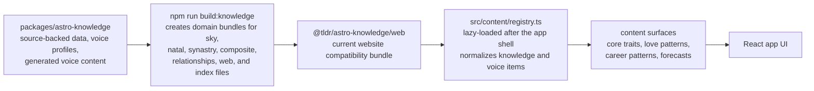

# Astrology Portal

A starter astrology website and member portal.

## Current scope

- Guest daily current-sky dashboard by location
- Supabase-backed account signup/sign-in UI for Google and email/password
- Logged-in profile page with saved starter charts
- Swiss Ephemeris current-sky calculations with deterministic fallback data
- Mock writing adapter that can be replaced with the supplied house style

## Run locally

```bash
npm install
npm run dev
```

Create a `.env.local` file using `.env.example` as a template.

```bash
VITE_MAPBOX_ACCESS_TOKEN=...
VITE_SUPABASE_URL=https://your-project.supabase.co
VITE_SUPABASE_PUBLISHABLE_KEY=sb_publishable_...
# Or use VITE_SUPABASE_ANON_KEY=... if your Supabase project shows an anon public key.
VITE_AUTH_REDIRECT_URL=http://127.0.0.1:5173
```

For production, add the same Supabase variables in Vercel. In Supabase, enable the Google provider under Authentication, then add `https://astrology-portal.vercel.app` as an allowed redirect URL.

## Integration points

- Ephemeris provider: `src/services/ephemeris.ts`
- Horoscope generation and writing style: `src/services/horoscopes.ts`
- Account/auth behavior: `src/services/auth.ts`
- Knowledge and voice content: `src/content/registry.ts`

The first build uses deterministic sample data so the product can be designed and tested before the licensed ephemeris and final writing style are added.

## Knowledge Base Integration

The app does not own astrology source material. The source of truth lives in the monorepo package at `packages/astro-knowledge`. Import the smallest domain bundle that matches the surface instead of the full package.

Keep this diagram updated whenever the package structure, dependency path, or content selection flow changes.



Run commands from the monorepo root. The root build compiles the knowledge package first, then builds this app against that generated package output.

The website lazy-loads `src/content/registry.ts` from `App.tsx` so the first HTML response and main app module do not preload the knowledge bundle. Keep new source-backed surfaces behind dynamic imports unless their content is required for the first paint.
