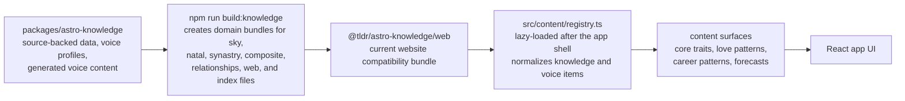

# TLDR Astro Web

The production TLDR Astro website and member portal.

## Current scope

- Guest daily current-sky dashboard by location
- Supabase-backed account signup/sign-in UI for Google and email/password
- Logged-in profile page with saved starter charts
- Social handles, private-account discovery controls, consent-based friend
  requests, shared friend charts, blocking, and contact-bound invitations
- Swiss Ephemeris current-sky calculations with deterministic fallback data
- Mock writing adapter that can be replaced with the supplied house style

## Run locally

```bash
npm install
npm run dev
```

Create a `.env.local` file using `.env.example` as a template.

```bash
VITE_MAPBOX_ACCESS_TOKEN=...
VITE_SUPABASE_URL=https://your-project.supabase.co
VITE_SUPABASE_PUBLISHABLE_KEY=sb_publishable_...
# Or use VITE_SUPABASE_ANON_KEY=... if your Supabase project shows an anon public key.
VITE_AUTH_REDIRECT_URL=http://127.0.0.1:5173
VITE_PHONE_AUTH_ENABLED=false
VITE_TLDRASTRO_API_URL=http://127.0.0.1:8000
```

For production, add the same Supabase variables in Vercel. In Supabase, enable the Google provider under Authentication, then add `https://astrology-portal.vercel.app` as an allowed redirect URL.

Phone OTP remains hidden unless `VITE_PHONE_AUTH_ENABLED=true`. Enable it only
after configuring and enabling an SMS provider under Supabase Authentication →
Sign In / Providers → Phone. The flag is a browser-visible feature toggle, not a
secret.

### Google sign-in setup

Google auth is brokered by Supabase, not by a Google client ID stored in this app. The app calls `supabase.auth.signInWithOAuth({ provider: "google" })`, then Supabase redirects to the Google OAuth client configured in the Supabase Dashboard.

If Google shows `Access blocked: Authorization Error` with `Error 401: deleted_client`, the Google OAuth client configured in Supabase has been deleted or replaced. Fix it in Supabase, then redeploy/retest:

1. In Google Cloud, create or restore a Web application OAuth client.
2. Add Supabase's Google callback URL as an authorized redirect URI: `https://<supabase-project-ref>.supabase.co/auth/v1/callback`.
3. In Supabase Dashboard, go to Authentication -> Providers -> Google.
4. Replace the Google client ID and client secret with the active OAuth client values.
5. Confirm Site URL and Redirect URLs include local and production app origins, such as `http://127.0.0.1:5173`, `http://localhost:5173`, and the production domain.
6. Restart the local dev server or redeploy the app if environment origins changed.

## Integration points

- Ephemeris provider: `src/services/ephemeris.ts`
- Calculation API client: `src/services/tldrastroApi.ts`
- Horoscope generation and writing style: `src/services/horoscopes.ts`
- Account/auth behavior: `src/services/auth.ts`
- Social RPCs and Realtime: `src/services/socialFriends.ts`
- Friends experience: `src/features/friends/SocialFriendsPanel.tsx`
- Block management: `src/features/settings/BlockedAccountsSettings.tsx`
- Knowledge and voice content: `src/content/registry.ts`

The browser ephemeris still supports current-sky UI. The FastAPI calculation
service owns serious natal, timing, synastry, composite, and relationship compare
responses. Start it from `services/tldrastro-api` and set
`VITE_TLDRASTRO_API_URL` before calling the client helpers.

## Social Feature Contract

The Social feature uses account friendships; it is separate from manually
entered Charts:

- **Circle** contains accepted account friends.
- **Charts** contains birth details the signed-in member entered manually and
  remains private to that member.
- **Requests** contains incoming requests only and appears only when its count
  is greater than zero. The same count badges the global Friends navigation
  item.
- Search temporarily replaces the active tab's content. Clearing search
  restores the previous tab.
- The handle remains editable only in Account. Discovery privacy and blocked
  accounts live together in **Settings → Social**; blocked members are managed
  on the second-level Blocked accounts page.

Search is live after two characters with a 180 ms debounce. Results are ranked
by exact handle, handle prefix, full-name prefix, token prefix, and small token
edit distance. The database, not the component, excludes private and blocked
accounts and applies per-account rate limits.

A pre-friend result may contain avatar, display name, handle, and Sun sign.
Moon, Rising, exact birth data, and natal chart JSON are not part of discovery.
After acceptance, a friend's photo and shared chart can be shown. Each member
can pause their own chart independently; the friend receives a `null` chart
from the Social RPC while sharing is paused.

The request state machine is:

```text
none -> pending -> accepted -> friendship
                 -> declined
     -> cancelled
```

Opposite-direction simultaneous requests resolve at the database boundary and
must not create duplicate pending rows or duplicate friendships. Removing a
friend deletes the friendship. Blocking additionally cancels requests, hides
both accounts from each other, and prevents new discovery or sharing until
unblocked.

`subscribeToSocialChanges` listens for request, friendship, and notification
changes through Supabase Realtime. Do not remove the window-focus refresh:
Realtime can disconnect and focus refresh is the recovery path.

### Invitations

The Friends UI creates a 30-day, single-use private share link:

1. The inviter creates an invite link without entering the friend's contact
   information.
2. Supabase stores only token-derived hashes. The raw token is returned once
   to the inviter and is not persisted.
3. The browser opens the native share sheet when available or lets the member
   copy the link.
4. The recipient opens the link and signs in or joins.
5. The recipient previews and accepts or declines the invitation.
6. Acceptance creates or reuses one canonical friendship and consumes the
   invitation.

Keep the invitation token in the URL only long enough to capture it into
session storage. Never log it, put it in analytics, or persist it in local
storage. The link is a bearer credential: anyone who receives it may use it
once, so the UI tells members to share it privately. Contact-bound email and
phone RPCs remain for backwards compatibility but are not surfaced.

### Social QA

Run from the monorepo root:

```bash
npm run qa:database-friends
node scripts/test-social-friends-contract.mjs
npm run typecheck
npm run build:web
```

The path-scoped workflow is
`.github/workflows/social-friends-security.yml`. Set the repository secret
`SUPABASE_TEST_DB_URL` to enable its rollback-only cross-user database job.

## Knowledge Base Integration

The app does not own astrology source material. The source of truth lives in the monorepo package at `packages/astro-knowledge`. Import the smallest domain bundle that matches the surface instead of the full package.

Keep this diagram updated whenever the package structure, dependency path, or content selection flow changes.



Run commands from the monorepo root. The root build compiles the knowledge package first, then builds this app against that generated package output.

The website lazy-loads domain registries from `App.tsx` so the first HTML response and main app module do not preload the knowledge bundles. Sky loads `src/content/skyRegistry.ts`, profile/natal surfaces load `src/content/natalRegistry.ts`, and friends/relationship surfaces load `src/content/relationshipRegistry.ts`. Keep new source-backed surfaces behind dynamic imports unless their content is required for the first paint.
