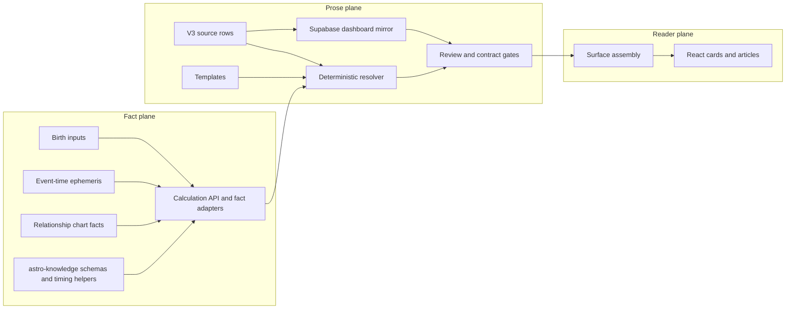
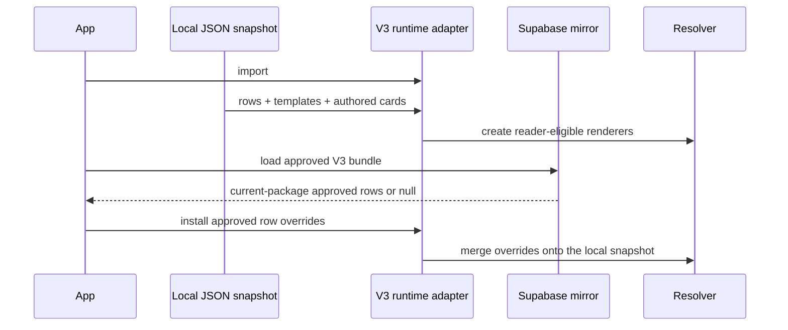
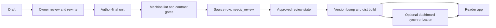

# TLDR Astro content architecture

Updated: 2026-07-29

This document explains how astrology facts become reader-facing copy across
Sky, You, Friends, Calendar, Daily, and Weekly. It is written for engineers and
coding agents. Product voice and editorial standards remain in the package
writing guide.

## 1. System boundaries

TLDR Astro has two content planes that must remain separate, followed by a UI
layer that renders their result.

### Fact plane

The fact plane answers questions such as:

- Where is Saturn at the event time?
- Which whole-sign house contains Aquarius for Gemini rising?
- Is a body retrograde?
- What is the exact date and active window of an aspect?
- Which endpoint of a synastry connection is being activated?

The primary owners are:

- `services/tldrastro-api`: chart, ephemeris, timing, and relationship
  calculations;
- `packages/astro-knowledge`: astrology meaning, schemas, voice contracts,
  optional timing/ranking helpers, and compiled knowledge bundles;
- app adapters in `apps/web/src/services` and `App.tsx`: normalize API facts
  into the narrow input objects accepted by content resolvers.

### Prose plane

The prose plane answers:

- Which approved unit explains these facts?
- Which hook and vocabulary rows fill this card shape?
- Is the unit reviewed and safe to serve?
- What should happen if content is missing?

The primary owner is:

`apps/web/src/content/fallbackArchitectureV3`

The Supabase dashboard mirrors this package for review, editing, and runtime
hydration. It is not an independent authoring source.

### UI plane

React owns layout, controls, card ordering, visibility, and interaction. It
receives complete reader-facing strings. It does not author interpretations or
repair incomplete prose.

## 2. End-to-end flow



The engine supplies facts. The resolver supplies approved language. The reader
boundary refuses unsafe or incomplete results. The UI renders the accepted
result.

## 3. Fact sources

### Natal chart

Natal facts are fixed for a person after birth inputs are resolved:

- planets and points in signs and degrees;
- whole-sign houses from the Ascendant;
- angles;
- natal aspects and aspect patterns;
- empty houses;
- traditional house rulers;
- profection house and ruler.

Whole-sign derivation is sign-based: the rising sign is the first house, and
each subsequent zodiac sign advances one house.

### Event-time ephemeris

Moving facts are recomputed for the relevant instant:

- current sign and degree;
- motion and retrograde state;
- ingress and station dates;
- lunations and eclipses;
- exact aspects and active windows;
- returns;
- void-of-course Moon periods.

The stale-sky invariant is strict: a content row may not claim a moving body's
sign, house, date, or retrograde state unless the engine supplied that value to
an explicit slot.

### Relationship facts

Relationship surfaces receive:

- both natal charts;
- cross-chart synastry aspects;
- composite facts where supported;
- bond-transit activations.

Bond transits group by:

```text
(transiting planet, aspect, endpoint planet, endpoint owner)
```

One grouped activation becomes one card. The transit aspects the endpoint; the
activation then flows through every synastry connection made by that endpoint.

## 4. The reader-content package

Path:

`apps/web/src/content/fallbackArchitectureV3`

### Package layout

| Path | Responsibility |
|---|---|
| `source-rows/fallback-source-rows-v3.json` | Main hook, vocabulary, and source-material banks |
| `source-rows/editorial-source-bank-v1.json` | Owner-authored, approved sign-axis, lunation, season, New Moon, and categorized quotable source material; deliberately non-serving until a resolver uses it |
| `source-rows/transit-synastry-rows-v1.json` | Authored transits, compatibility, and relationship units |
| `source-rows/bond-language-pass-2.json` | Review-gated, same-key bond-effect supersessions |
| `source-rows/lunation-blend-units-v1.json` | Lunation macro and per-rising blend rows |
| `source-rows/placement-interim-fixes-v1.json` | Placement frames and targeted vocabulary corrections |
| `source-rows/sky-article-v1.json` | Validity-window sky article registry, archive articles, approved date-slot frames, and sky-scoped vocabulary |
| `source-rows/sky-placement-inventories-voice-pass-v1.json` | Forty-two review-gated slot-tier voice-pass candidates; supersede approved V3 rows only after owner approval |
| `source-rows/sky-planet-frames-v1.json` | Owner-approved three-beat planet frames: 14 direct and 9 shadow-to-shadow retrograde replacements |
| `source-rows/sky-sign-copy-sun-v1.json` | Owner-approved revised continuous Sun-in-Leo fallback unit plus thirteen superseded historical rows; the other V2 units remain outside the reader package until approval |
| `authored-inputs/sky-placement-continuous-v2-pending.json` | Review-gated import manifest for the remaining Sun, Mercury, Venus, Mars, slow-mover, Chiron, and node units; also records the superseded legacy module families |
| `contracts/SKY-PLACEMENT-CONTINUOUS-V2.schema.json` | Required continuous-unit slots and active-aspect insert contract |
| `packages/astro-knowledge/voice/tldr-astro/fallback-canonical-template.md` | Verbatim owner-approved canonical planet-in-sign fallback specification |
| `scripts/import-sky-placement-continuous-v2.mjs` | Validates staged review files without writing by default; requires both `--approve` and an explicit `--out` path before it emits importable rows |
| `source-rows/station-cards-week-openers-v1.json` | Weekly openers and station units |
| `templates/fallback-templates-v3.json` | Slot-bearing fallback templates |
| `resolver/renderFallback.*` | Natal, empty-house, aspect, and profection assembly |
| `resolver/renderTransitSynastry.*` | Transit, Sky, lunation, Calendar, Friends, Daily, and Weekly units |
| `contracts/CONTENT-ROLE-CONTRACT.json` | Role and grammar-frame contract |
| `dist/tldr-content.js` | Built browser artifact; never hand-edit |
| `content-book.html` | Generated, human-readable review book |

The package currently contains roughly seven thousand records. Counts are
descriptive, not contractual; use the materializer's dry-run output when exact
numbers matter.

## 5. Content roles

Every row has a stable `contentKey`. Reader-facing package rows also declare a
role and review status.

| Role | Meaning | Reader eligible? | Rule |
|---|---|---:|---|
| `full_copy` | Complete authored unit for an exact surface/combination | Yes, when approved | Serve verbatim |
| `authored_card` | Complete authored card used by newer package families | Yes, when approved | Serve verbatim |
| `fallback_hook` | Complete reusable sentence or paragraph with declared slots | Yes, when approved | Insert whole |
| `template` | Surface structure with required and optional slots | Yes, when fully resolved | Never partially render |
| `vocabulary` | Grammar-framed word or phrase used inside templates | Yes, inside compatible slots | Never display alone |
| `fallback_source` | Research, extraction, or authoring ingredient | No | Must never reach a reader |

### Review eligibility

Production reader statuses:

```text
approved
approved_reuse
reviewed
```

`needs_review` is available to admin workflows but is filtered out of the
reader bundle.

## 6. Content-key design

Keys encode the narrowest stable selection facts:

```text
authored/transit-aspect/{transiting}/{natal}/{aspect}
authored/transit-house-sign/{planet}/{house}/{sign}
authored/compat-pair/{planet}/{reader-sign}/{other-sign}

fallback-hook/placement-sentence/{planet}/{sign}
fallback-hook/lunation-ruler-house/{house}
fallback-hook/sky-placement-hook/{planet}/{sign}
fallback-hook/sky-placement-aspect/{a}/{b}/{aspect}/{sign?}

fallback-vocab/house-jurisdiction/{house}
fallback-vocab/sign-need/{sign}
fallback-vocab/planet-function/{planet}
```

Do not encode a moving fact in a key unless the resolver derives that key from
the event-time fact object.

## 7. Resolution

The governing selection order is:

```text
1. Exact approved authored unit
2. Approved template + hooks + vocabulary
3. SOURCE_GAP
```

For Sun, Mercury, Venus, Mars, Jupiter, Saturn, Uranus, Neptune, Pluto, Chiron,
and the nodes, step 2 means one approved continuous unit under
`sky-placement-continuous-v2`. The retired placement module stack is not a
fallback for those bodies. Moon and lunation rendering remain outside this
contract.

Resolution must be:

- deterministic;
- driven only by input facts;
- complete before rendering;
- review-gated;
- free of unresolved slots;
- voice-safe;
- equivalent in the Node and browser implementations.

### Required and optional slots

A missing optional block is omitted as a block. A missing required slot fails
the unit. Never leave a divider, eyebrow, label, or card shell for a missing
block.

### Voice

Voice is represented by complete `body_you` and `body_they` fields or by
template-level person slots. Do not perform global pronoun replacement inside
prose.

### Refusal

`SourceGapError` means the content system cannot safely describe the computed
fact. The call site should omit that unit and log enough information to locate
the missing key. It must not synthesize replacement prose.

## 8. Runtime package installation

The web runtime has two package sources:

1. A local snapshot assembled in
   `apps/web/src/content/fallbackArchitectureV3Runtime.ts`.
2. An asynchronously loaded, approved dashboard mirror from
   `generated_interpretations`.



Important consequences:

- The app can render from the local package before network hydration finishes.
- Missing dashboard rows remain supplied by the current local snapshot.
- Only approved package review states survive dashboard loading.
- Dashboard rows must carry the import batch for the installed package version.
  A mixed or older batch is rejected in full.
- Local browser cache is versioned by both the installed package version and
  the dashboard's latest update time. Older cache schemas fail closed to the
  local snapshot.
- Pagination is ordered by update time and unique row ID so tied import
  timestamps cannot repeat or skip rows between pages.
- Dashboard synchronization is a deployment action, not an ordinary file edit.

## 9. Generated interpretations versus V3 package copy

`generated_interpretations` stores more than the V3 mirror. Some surfaces look
up exact live rows by content key before using package or knowledge fallback.

The reader boundary in `generatedContent.ts` rejects:

- non-live serving rows where live state is required;
- rows with unresolved review state;
- unsafe metadata markers;
- `fallback_source` and source-material roles;
- unsafe or malformed reader fields;
- legacy or superseded lanes.

There is not one universal call path for every screen. When debugging a
sentence, trace the surface call site to learn whether it:

1. requests an exact generated row;
2. calls a V3 renderer directly;
3. consults an `@tldr/astro-knowledge` registry;
4. uses one of those results only as a fallback floor.

Do not infer precedence from the row's existence alone.

## 10. Surface map

### You: natal

| Surface | Facts | Resolver | Main families |
|---|---|---|---|
| Placements | planet, sign, house, dignity, retrograde, sect | `renderNatalPlacement` | placement frames, `placement-sentence`, sign/house vocab |
| Angles | angle, sign | `renderNatalAngle` | placement-angle sentences |
| Empty houses | house, cusp sign, traditional ruler, ruler placement | `renderNatalEmptyHouse` | `house-cusp`, `house-jurisdiction`, placement sentence, bridge |
| Natal aspects | two placements, aspect | `renderNatalAspect` | `aspect-pair`, aspect vocab |
| Profections | age, house, sign, ruler | `renderProfectionYear` | profection house/ruler rows |

### You: timing

| Surface | Facts | Resolver | Main families |
|---|---|---|---|
| Transit aspect | transiting body, natal endpoint, aspect, window | `renderTransitAspect` | `authored/transit-aspect`, effect fallbacks |
| House transit | body, house, sign, motion, events, window | `renderTransitHouse` | authored intro/sign layers, house effects, retro overlay |
| Retrograde | body, sign, window | `renderTransitRetro` | retrograde articles and hooks |
| Return | returning body | `renderTransitReturn` | return units |

### Sky

| Surface | Facts | Resolver | Main families |
|---|---|---|---|
| Current placement | body, sign, motion, ingress range, live aspects | `renderSkyPlacement` | tagline, hook, lived, moves, turn, aspect paragraphs |
| Aspect card | two bodies, aspect, signs, date | `renderSkyAspectCard` | sky aspect rows |
| Season | sign and current events | `renderSkySeason` | season rows |
| Lunation article | kind, sign, date, nodes, event aspects | `renderSkyLunation`, `renderLunationMacro` | macro, sign section, mechanics, close |

A Sun–Moon opposition is a Full Moon event, not a generic hard-aspect
paragraph. Sign-specific Full Moon rows may supersede the generic aspect frame,
while sign and date remain computed.

### Per-rising lunation blend

`renderLunationHoroscope` computes:

1. `moonHouse`;
2. `sunHouse` for Full Moons and lunar eclipses;
3. `rulerHouse` from the traditional ruler's event-time placement;
4. optional ruler retrograde state;
5. optional Uranus layer only when Uranus is computed as closely involved.

Cancer and Leo lunations skip the ruler line when the Moon or Sun rules its own
lunation. A missing optional ruler-house or Uranus row does not invalidate the
rest of the card.

### Friends

| Surface | Facts | Resolver | Main families |
|---|---|---|---|
| Compatibility | two chart signs/placements | `renderCompat`, `renderDoDont` | compat pair/deep rows |
| Synastry connection | reader endpoint, friend endpoint, aspect | `renderSynastryAspect` | synastry-pair rows |
| Bond transit | transit, activated endpoint, grouped connections, window | `renderBondTransit` | per-aspect bond effects, soft/hard fallback |

Serving relationship prose says “connection,” not “contact.” “Contact” remains
an engine term for a computed aspect and is acceptable in code comments or data
types.

### Calendar, Daily, and Weekly

| Surface | Facts | Resolver/assembler |
|---|---|---|
| Calendar phase | phase, sign | `renderCalendarPhase` |
| Void Moon | current and next sign | `renderVoidOfCourse` |
| Daily glance | strongest natal aspect or Moon house | `renderDailyGlance` |
| Behind this forecast | active transit labels and engine windows | `renderTransitLabel` |
| Weekly | ranked Mon-Sun event list | `buildWeeklyHoroscope` plus V3 renderers |

Weekly is one composed horoscope:

```text
approved opener
  + up to four dated event sections
  + full per-rising lunation blend when applicable
  + background changes from the prior week
```

It is not seven generic daily cards. Event dates and positions come from the
ephemeris for that event, not from the current screen date. The product
publishes the week on Sunday at 8 p.m. local time and covers Monday through
Sunday. Event priority is:

```text
eclipse > lunation > station > headliner > standard > quiet
```

Quiet weeks fall back to `renderWeeklyMoon`.

## 11. Worked example: Aquarius Full Moon for Gemini rising

| Output movement | Content source | Computed fact |
|---|---|---|
| Recognizable ninth-house situation | `lunation-opening-situation/9` | Aquarius counted from Gemini rising |
| Moon lights up the ninth house | Moon-house frame + house vocabulary | Aquarius counted from Gemini rising |
| Compact Aquarius Full Moon meaning | `lunation-sign-compact/aquarius` | kind and sign |
| Third-versus-ninth counterpoint | counterpoint frame + house vocabulary, woven into the compact core | Sun in Leo counted from Gemini rising |
| Saturn rules from the eleventh | `lunation-ruler-house/11` | Saturn rules Aquarius; Saturn in Aries; Aries is eleventh |
| Retrograde overlay | `lunation-ruler-retro` | Saturn retrograde at event time |
| Uranus layer | `lunation-uranus-layer/1` | Uranus in Gemini and close to the lunation |
| Present-tense ending | `lunation-week-layer` | weekly rendering context |

If Saturn occupies a different sign on a future event date, the same content
families assemble a different ruler-house paragraph without editing prose.
The full Sky sign section and the former manifestations, moment, Release/Shift,
and Higher Path stack do not render in the per-rising card.

## 12. Worked example: empty second house

Given:

- Cancer on the second-house cusp;
- Moon as Cancer's traditional ruler;
- natal Moon in Scorpio in the sixth house.

The empty-house renderer assembles:

1. Cancer-on-house frame plus the second-house jurisdiction list;
2. one ruler handoff to the Moon;
3. the existing Moon-in-Scorpio placement sentence;
4. the second-house bridge lead completed with the compact sixth-house
   jurisdiction;
5. a labeled timing line naming the traditional ruler and the source house.

The full jurisdiction list appears once. The ruler handoff reads only the
primary traditional ruler. Modern
co-rulers are not read by this path.

## 13. Authoring and release pipeline



Machine lint reports problems to the owner. It does not silently rewrite
author-final prose.

## 14. Build and distribution

The browser artifact exports both resolver factories and `PACKAGE_VERSION`:

`apps/web/src/content/fallbackArchitectureV3/dist/tldr-content.js`

Rebuild it from `resolver/index.browser.ts`. Never patch it by hand.

The runtime imports the built resolver plus source JSON to construct the local
snapshot. This is intentional: the built artifact owns executable selection
logic, while source rows remain inspectable and materializable.

The package version must change when serving behavior or package content
changes. Version assertions prevent a source change from shipping with a stale
bundle.

The content book is also generated and must be rebuilt after serving row
changes.

## 15. Contracts and tests

### Global gates

- `CONTENT-CONTRACT.md`
- `scripts/test-reader-facing-content-contract.mjs`
- `scripts/test-authored-verbatim-rendering.mjs`
- `scripts/test-fallback-refresh-wiring.mjs`
- `npm run test:content`

### Surface gates

- natal/empty houses: `test-empty-house-refinement.mjs`
- placements: `test-placement-interim-fixes.mjs`
- Sky: `test-sky-placement-regressions.mjs`
- lunations: `test-lunation-blend-assembly.mjs`
- Weekly: `test-weekly-horoscope-assembly.mjs`
- bond transits: `test-bond-transit-grouping.mjs`
- web/API houses: `test-web-api-house-parity.mjs`

Tests should assert product invariants, not merely snapshot current wording. Use
byte equality only for explicitly locked author-final units and worked examples.

## 16. Diagnosing common failures

### Correct locally, stale after a moment

Likely cause: the approved dashboard mirror hydrated after the local snapshot
and contains an older row.

Check:

- package version;
- local row;
- materialized dashboard row;
- cached dashboard version;
- whether the dashboard was synchronized after the package change.

### Correct copy, wrong sign or house

Likely cause: the resolver received facts for the wrong time or chart. Do not
edit prose. Inspect the event-time ephemeris and house derivation.

### Needs-review copy appears to be missing

That is expected reader behavior. Preview in admin or approve it through the
owner workflow.

### Empty card or empty labeled section

The call site rendered chrome for a missing optional unit. Omit the whole slot
or card. Do not supply placeholder copy.

### Friend copy has broken pronouns

The wrong voice field or string substitution path was used. Resolve a complete
`body_they` or a template-level voice slot; never replace pronouns across an
authored paragraph.

### Duplicate cards with the same body

The event identity or grouping key is too granular. Fix grouping in the fact or
surface assembler. Do not rotate copy variants to conceal duplicate events.

## 17. Agent operating protocol

For every content task:

1. Read this document and the surface-specific spec.
2. Inspect the working tree and preserve unrelated edits.
3. Find the exact call site, renderer, key, and row.
4. Prove whether the defect is in facts, selection, review, hydration, prose, or
   presentation.
5. Use only owner-approved prose.
6. Keep copy in rows and computed facts in resolver inputs.
7. Update Node and browser resolvers together.
8. Add a regression at the narrowest stable boundary.
9. Rebuild the distribution bundle and content book when required.
10. Run focused gates, the content suite, typecheck, and build in proportion to
    the change.
11. Do not synchronize remote dashboard state without authorization.
12. Report files, version, tests, dashboard state, and untouched unrelated work.

When facts or owner intent are ambiguous, stop and route the ambiguity to the
owner. Do not fill uncertainty with plausible astrology or plausible prose.
