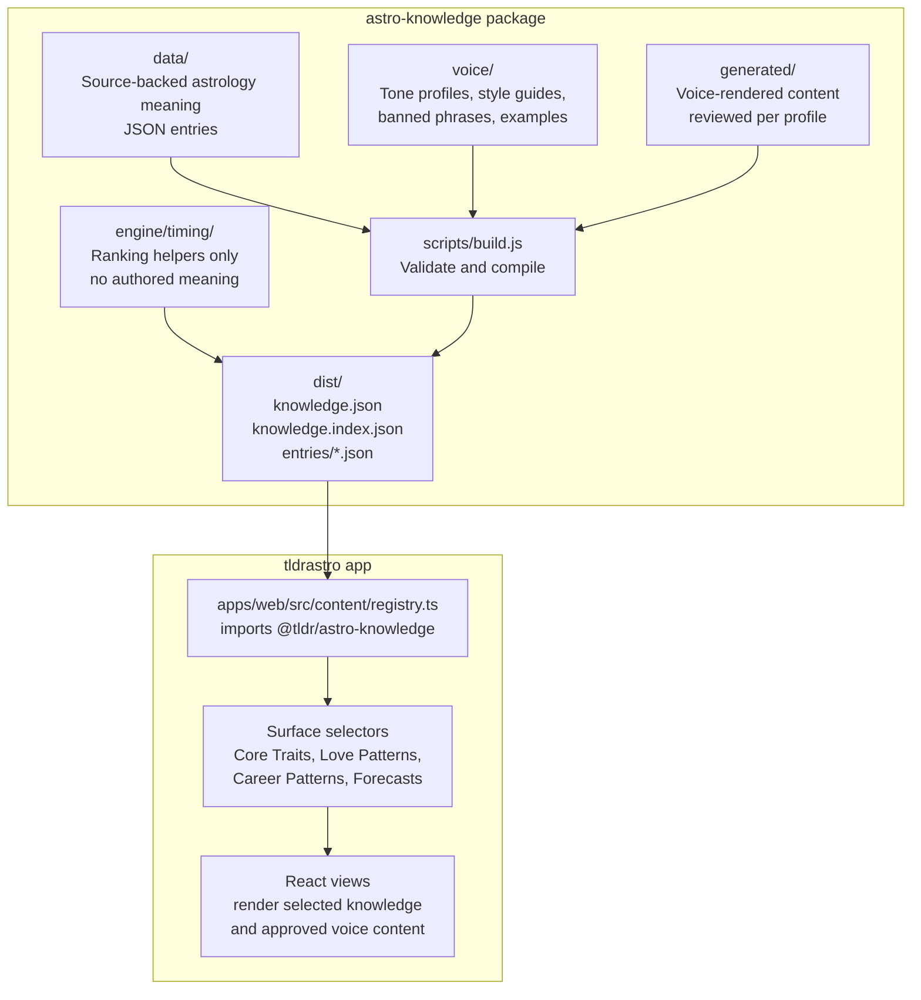

# Astrology Knowledge Base

Standalone shared content package for astrological meaning. This repository is the single source of truth for authored astrology content consumed by the website and React Native app.

## Architecture

- `data/` is meaning: authored JSON only, one editable entry per file where possible.
- `voice/` is voice: rendering constraints, profiles, banned words, and prompt stubs. It does not contain astrology meaning.
- `generated/` is voice-rendered content: approved output created from `data/` plus a voice profile.
- `scripts/` is build tooling: validation and compilation only. No astrology interpretation lives in code.
- `engine/timing/` is optional app logic: profection context and transit ranking only. It does not contain authored meaning or voice.
- `dist/` is generated output. Apps consume `dist/`, never `data/`.

Authoring shape and shipping shape are intentionally different. Human authors edit small JSON files in `data/`; `npm run build` validates and compiles those files into versioned static files under `dist/`.

## Knowledge Flow

Keep this diagram updated whenever the knowledge package structure or app consumption path changes.



### Ownership Rules

- Put source-backed astrology meaning in `data/`.
- Put tone, style, and prompt constraints in `voice/`.
- Put reviewed voice output in `generated/`.
- Put selection, ranking, and UI logic in the consuming app.
- Do not vendor a copied knowledge JSON into an app. Apps should import `@tldr/astro-knowledge`.

## Offline Consumption

Both consumers can bundle this package for offline use.

Web and React Native can import the merged bundle:

```js
import knowledge from "@tldr/astro-knowledge";
```

For single-entry loading without parsing the whole corpus, bundle `dist/entries/` and read `dist/knowledge.index.json`. Each id maps to a generated entry file:

```js
import index from "@tldr/astro-knowledge/index";

const location = index.entries["mars-square-saturn"];
// location.file === "entries/mars-square-saturn.json"
```

The optional timing engine can rank already-computed transit candidates before the app looks up meaning:

```js
import { buildAnnualTimingContext, rankTransits } from "@tldr/astro-knowledge/timing-engine";

const timing = buildAnnualTimingContext({
  birthDate: "1994-04-12",
  currentDate: "2026-06-02",
  ascendantSign: "scorpio"
});

const rankedTransits = rankTransits(activeTransits, timing);
```

The timing engine does not calculate planets or write interpretations. It only helps the app decide which available transit meanings deserve priority for a specific user.

## Adding An Entry

1. Choose the correct folder in `data/`.
2. Create one JSON file whose filename matches the entry `id`.
3. Keep interpretive fields as `PLACEHOLDER - author from source` until the approved source text is authored.
4. Set `status` to `TODO`, `DRAFT`, `REVIEWED`, or `LIVE`.
5. Run:

```sh
npm run build
```

The build fails if validation fails and reports the file and field that need attention.

## Fix-An-Interpretation Test

A non-engineer should be able to edit one file in `data/`, run `npm run build`, and ship the generated `dist/` bundle. Do not add meaning to `scripts/` or application code.

## Generated Files

`dist/` contents are generated and ignored by git except for `dist/.gitkeep`.
