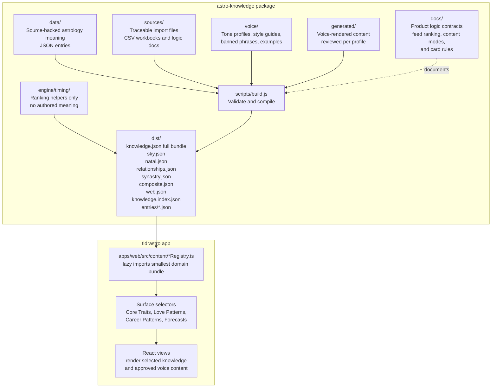

# Astrology Knowledge Base

Standalone shared content package for astrological meaning. This repository is the single source of truth for authored astrology content consumed by the website and React Native app.

## Architecture

- `data/` is meaning: authored JSON only, one editable entry per file where possible.
- `voice/` is voice: rendering constraints, profiles, banned words, and prompt stubs. It does not contain astrology meaning.
- `generated/` is voice-rendered content: approved output created from `data/` plus a voice profile.
- `sources/` is traceable imported source material used to create generated corpora, such as review CSVs and rewrite workbooks.
- `scripts/` is build tooling: validation and compilation only. No astrology interpretation lives in code.
- `engine/timing/` is optional app logic: profection context and transit ranking only. It does not contain authored meaning or voice.
- `docs/circle-feed-logic.md` is the product logic contract for scoring and rendering knowledge-backed feed items.
- `docs/content-modes.md` defines Feed, In-Depth, and Article voice modes by surface.
- `dist/` is generated output. Apps consume `dist/`, never `data/`.

Authoring shape and shipping shape are intentionally different. Human authors edit small JSON files in `data/`; `npm run build` validates and compiles those files into versioned static files under `dist/`.

## Knowledge Flow

Keep this diagram updated whenever the knowledge package structure or app consumption path changes.



### Ownership Rules

- Put source-backed astrology meaning in `data/`.
- Put tone, style, and prompt constraints in `voice/`.
- Put reviewed voice output in `generated/`.
- Put imported CSVs, workbooks, and logic docs in `sources/`, then convert them into structured JSON under `generated/` with a script.
- Put selection, ranking, and UI logic in the consuming app.
- Keep product-level feed scoring and card rules documented in `docs/circle-feed-logic.md`.
- Keep surface-specific voice modes documented in `docs/content-modes.md`.
- Do not vendor a copied knowledge JSON into an app. Apps should import the smallest `@tldr/astro-knowledge` bundle that matches the surface.

### Content ID Namespaces

Use domain-prefixed IDs for user-facing lookups so the same astrology phrase can mean different things on different surfaces:

- `sky-sun-in-gemini`: current collective sky, such as Gemini season.
- `natal-sun-in-gemini`: a birth chart placement.
- `transit-natal-venus-conjunction-saturn`: current sky contacting a natal chart.
- `synastry-venus-square-mars`: person-to-person chart contact.
- `composite-moon-in-cancer`: relationship chart as its own entity.

Legacy unprefixed IDs such as `sun-in-gemini` and `venus-conjunction-saturn` may remain as aliases during migration, but new app code should request the domain-specific ID.

## Offline Consumption

Both consumers can bundle this package for offline use.

Web and React Native can import the merged bundle when they truly need the whole corpus:

```js
import knowledge from "@tldr/astro-knowledge";
```

Most surfaces should import a smaller domain bundle:

```js
import skyKnowledge from "@tldr/astro-knowledge/sky";
import natalKnowledge from "@tldr/astro-knowledge/natal";
import relationshipKnowledge from "@tldr/astro-knowledge/relationships";
import synastryKnowledge from "@tldr/astro-knowledge/synastry";
import compositeKnowledge from "@tldr/astro-knowledge/composite";
```

The current website lazy-loads domain registries from `apps/web/src/content/skyRegistry.ts`, `natalRegistry.ts`, and `relationshipRegistry.ts`. The older `web.json` compatibility bundle remains available for consumers that still need one merged website bundle.

Bundle intent:

- `sky.json`: current sky, planetary weather, lunations, and transit framework material.
- `natal.json`: natal placements, transit-to-natal meanings, angles, chart rulers, point placements, point aspects, and insight cards.
- `relationships.json`: combined relationship compatibility bundle for consumers that need both synastry and composite.
- `synastry.json`: chart-to-chart contacts, overlays, bond types, and synastry policy material.
- `composite.json`: relationship-as-its-own-chart material and composite synthesis examples.
- `web.json`: the smaller bundle the current website needs until route-level lazy loading is introduced.
- `knowledge.json`: full compatibility bundle.

For single-entry loading without parsing the whole corpus, bundle `dist/entries/` and read `dist/knowledge.index.json`. Each id maps to a generated entry file:

```js
import index from "@tldr/astro-knowledge/index";

const location = index.entries["mars-square-saturn"];
// location.file === "entries/mars-square-saturn.json"
```

The optional timing engine can rank already-computed transit candidates before the app looks up meaning:

```js
import { buildAnnualTimingContext, rankTransits } from "@tldr/astro-knowledge/timing-engine";

const timing = buildAnnualTimingContext({
  birthDate: "1994-04-12",
  currentDate: "2026-06-02",
  ascendantSign: "scorpio"
});

const rankedTransits = rankTransits(activeTransits, timing);
```

The timing engine does not calculate planets or write interpretations. It only helps the app decide which available transit meanings deserve priority for a specific user.

## Adding An Entry

1. Choose the correct folder in `data/`.
2. Create one JSON file whose filename matches the entry `id`.
3. Keep interpretive fields as `PLACEHOLDER - author from source` until the approved source text is authored.
4. Set `status` to `TODO`, `DRAFT`, `REVIEWED`, or `LIVE`.
5. Run:

```sh
npm run build
```

The build fails if validation fails and reports the file and field that need attention.

## Fix-An-Interpretation Test

A non-engineer should be able to edit one file in `data/`, run `npm run build`, and ship the generated `dist/` bundle. Do not add meaning to `scripts/` or application code.

## Generated Files

`dist/` contents are generated and ignored by git except for `dist/.gitkeep`.

## V4 Rewrite Corpus

The V4 tarot-core rewrite package lives in `sources/tldr-astrology-tarot-rewrites-v4/` when those files are available locally. The build runs `scripts/import-v4-rewrites.js` before compiling the knowledge bundle.

That importer converts the source CSVs into structured voice content under `generated/tldr-astro/rewrite-corpora/`:

- `tldr-v4-sky-rewrites.json`
- `tldr-v4-natal-chart-rewrites.json`
- `tldr-v4-transit-to-natal-rewrites.json`
- `tldr-v4-content-architecture.json`
- `tldr-v4-tarot-ontology.json`

The current rewrite CSV set is stored in `sources/tldr-astrology-rewrite-csvs/`. Those rows compile into `generated/tldr-astro/rewrite-corpora/tldr-rewrite-csvs/` and are aliased to the V4 lookup IDs until the tarot-core V4 files are available.

The app should not load these large corpora in ordinary UI bundles. `scripts/build.js` keeps them out of `sky.json`, `natal.json`, `relationships.json`, `synastry.json`, and `composite.json`, then writes a separate `dist/rewrite-corpora.json` bundle for backend tooling. The content-generation API reads the generated corpus files directly and uses them as source-backed examples for structure, voice, and field logic. Current astrology facts still control what the generated interpretation can claim.
