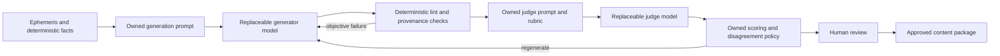

# TLDR Astro editorial AI system

This guide explains how TLDR Astro uses language models for writing and
editorial review. It is written for product owners, editors, developers, and
coding agents.

## The short explanation

TLDR Astro should own the editorial system. A model should be a replaceable
worker inside that system.

We own:

- the astrological facts supplied to the model;
- the writing prompts and output schemas;
- the editorial rubric used to judge writing;
- approved examples and intentionally weak controls;
- the rules that decide what needs human review;
- the audit trail and publication decision.

The model does one temporary job: given an input, it returns a proposed output.
It does not own the facts, house style, approval standard, or publication
authority.

This is similar to owning a recipe while being able to change kitchens. The
oven may behave differently, so each kitchen needs testing, but the ingredients,
recipe, quality standard, and decision to serve the food remain ours.

## Why generation and judging are separate

The generator and judge answer different questions:

| Component | Question |
| --- | --- |
| Deterministic astrology engine | What is astrologically true at this time? |
| Generator | How can those supplied facts become useful prose? |
| Mechanical linter | Did the draft break any objective writing rules? |
| Judge | How well does the draft match the owned editorial rubric? |
| Human editor | Is this actually ready to publish? |

The generator should not judge its own work using the same hidden assumptions.
TLDR Astro therefore supports separate provider, model, and key configuration
for generation and judging. They may use the same provider, but they are
independently replaceable.

Using a different model for judging can reduce correlated errors, but it does
not make the judgment automatically correct. The owned controls and human
review policy remain necessary.

## End-to-end flow



No language model calculates placements, ingresses, houses, aspects, dates,
degrees, or lunar events. Those facts must come from the ephemeris and
deterministic application code.

## What model-independent really means

Model-independent does not mean pretending every model responds identically to
one prompt. Models differ in instruction following, verbosity, style, factual
discipline, latency, and cost.

The implemented structure is:

1. An owned canonical prompt and rubric define the product contract.
2. A small model-specific overlay may adjust formatting or instruction order.
3. The output schema and publication policy do not change by provider.
4. Every model-plus-prompt combination must pass the same evaluation suite.

Do not hide product rules inside a provider-specific prompt. A model overlay may
help a model follow the contract, but it may not redefine the contract.

## The release unit

A model name alone is not a release. The minimum release unit is:

```text
provider
+ model version
+ generation prompt version
+ judge prompt version
+ rubric version
+ evaluation-set version
+ policy version
```

Changing any one of these can change results. Record the complete combination
with every verdict so a result can be reproduced, compared, or rolled back.

The current judge audit records the provider/model, temperature, prompt and
rubric versions and hashes, content hash, sample scores, privacy mode, and
disagreement status. Raw proprietary content is not written to the audit log.

## Calibration: proving that a judge is useful

A judge is not useful merely because it agrees with itself. It must distinguish
strong writing from known weak writing.

The calibration set contains:

- byte-verified, owner-approved examples;
- intentionally weak controls containing known failure modes;
- repeated samples to reveal instability;
- a minimum score separation between the approved and weak groups.

If repeated samples disagree, the result enters the human-review lane. Do not
average away disagreement and call the model calibrated.

The calibration examples are evaluation data. They should not also become
training examples unless a separate, deliberate dataset decision is made. A
model should not be tested on text it was trained to reproduce.

## Publication policy

Language-model verdicts are advisory:

- Score 3: human review, with a recommendation to approve.
- Score 2: human review, with a recommendation to revise.
- Score 1: regenerate or reject.
- Disagreement between samples: human review.

A single LLM call may never publish content. The only automatic exception is an
exact byte match to a separately human-approved canonical asset. In that case,
the human-approved asset is the authority, not the model.

## Privacy and authorization

Ordinary tests make no network calls. Live judging is a private CI or admin
operation and requires explicit environment authorization.

By default, common email, phone, and social-handle patterns are redacted before
a prompt is sent. Unredacted use requires both an approved-provider privacy mode
and an explicit provider approval flag. These variables belong in protected
server or CI configuration, never in browser code.

See [Private editorial intelligence](../editorial-intelligence.md) for the exact
environment variables, commands, and audit fields.

## How a human changes models

Do not replace a production model by editing one default and hoping the writing
still works.

1. Choose a candidate generator or judge model and create a complete release
   JSON file.
2. Stage it in the appropriate registry lane without changing the active
   release.
3. Run the offline contract and fixture-integrity tests.
4. Run the explicitly authorized live calibration against approved examples,
   weak controls, and held-out examples.
5. Compare factual additions, voice scores, disagreement rate, latency, and
   cost with the current model.
6. Have a human review representative outputs and approve or reject promotion.
7. Promote the complete release unit using an explicitly authorized admin or
   CI action and a passing calibration report.
8. Keep the previous release unit available for rollback.

The versioned registry is
[`config/editorial-model-registry.json`](../../config/editorial-model-registry.json).
Each surface lane records active, candidate, rollback, and promotion history.
The active release supplies runtime defaults; protected environment variables
may override it for an experiment, and the verdict audit marks that override.

Promotion is deliberately stronger than editing a model string. It requires a
staged candidate, a passing calibration report for that release, no sample
disagreement, the minimum approved-versus-weak separation, a named approver,
and `TLDR_ALLOW_MODEL_PROMOTION=1`. The previous active release becomes the
rollback release automatically.

## Rules for coding agents

Agents working in this repository must follow these rules:

1. Never hardcode an astrological placement, sign, house, aspect, degree, date,
   station, or lunation into generated prose logic. Use the ephemeris and
   deterministic resolvers.
2. Never move astrology meaning into a prompt merely to make one model produce
   the desired answer. Meaning belongs in the governed content or fact input.
3. Never modify approved examples or weak controls to make a calibration pass.
   Fix the prompt, adapter, rubric, or candidate model.
4. Never weaken the minimum separation requirement without owner approval.
5. Never turn sample disagreement into an automatic pass.
6. Never make the generator and judge share configuration implicitly.
7. Never send live content to a provider without explicit judge authorization
   and the required privacy mode.
8. Never publish content solely because an LLM returned score 3.
9. Preserve prompt, rubric, model, dataset, and policy provenance with every
   verdict.
10. Route ambiguity about voice, approval, privacy, or factual provenance to a
    human owner.

## Repository map

| Concern | Location |
| --- | --- |
| Generator and model adapters | `scripts/generate-sky-aspect-cards.js` |
| Shared judge authorization/audit runtime | `scripts/editorial-judge-runtime.js` |
| Publication recommendation policy | `scripts/editorial-judge-policy.js` |
| Model registry and release manifest | `config/editorial-model-registry.json` |
| Registry administration | `scripts/manage-editorial-model-registry.js` |
| Registry contracts | `scripts/test-editorial-model-registry.js` |
| Surface-specific judges | `scripts/judge-*-voice.js` |
| Approved long-form examples | `voice/tldr-astro/fixtures/sky-article-longform/` |
| Weak long-form controls | `voice/tldr-astro/fixtures/sky-article-longform/weak-controls/` |
| Private fine-tuning scaffold | `private-model/` |
| Operational judge documentation | `docs/editorial-intelligence.md` |

## Commands

Run offline verification without sending content to a provider:

```sh
cd packages/astro-knowledge
npm run test:article-voice-routing
npm run test:article-judge-calibration
npm run test:model-registry
npm run model-registry:validate
npm run test:private-model-data
npm run validate
```

Inspect active, candidate, and rollback releases:

```sh
npm run model-registry:status
```

Stage a complete candidate release without changing live behavior:

```sh
node scripts/manage-editorial-model-registry.js stage \
  --lane judge:sky-article-longform \
  --release-file /approved/admin/candidate-release.json
```

After live calibration and human review, promotion is an explicitly authorized
admin/CI operation:

```sh
TLDR_ALLOW_MODEL_PROMOTION=1 \
node scripts/manage-editorial-model-registry.js promote \
  --lane judge:sky-article-longform \
  --calibration-report /approved/admin/calibration-report.json \
  --approved-by editor@example
```

Rollback uses the same authorization requirement:

```sh
TLDR_ALLOW_MODEL_PROMOTION=1 \
node scripts/manage-editorial-model-registry.js rollback \
  --lane judge:sky-article-longform \
  --approved-by editor@example
```

Run live calibration only from an authorized private CI/admin environment:

```sh
TLDR_ALLOW_LIVE_LLM_JUDGE=1 \
TLDR_ALLOW_LIVE_LLM_CALIBRATION=1 \
npm run calibrate:article-judge:live
```

The other authorized calibration commands are documented in
[Private editorial intelligence](../editorial-intelligence.md).

## Current status

The model-swappable judge boundary, versioned registry, candidate/promotion/
rollback workflow, authorization gates, audit metadata, approved/weak
calibration controls, disagreement routing, privacy controls, and human
publication gate are implemented.

The private fine-tuning dataset pipeline is also scaffolded, but the current
long-form dataset is not large enough to train. Its validator requires at least
50 approved training examples; the current verified export contains one
training example and one evaluation example. Continue collecting diverse,
owner-approved examples before paying for a training run.
